# Early Fault Detection en Parques Eólicos

Sistema de detección temprana de anomalías en aerogeneradores basado en **autoencoders**, evaluado sobre el dataset **CARE to Compare — Wind Farm A**.

> El modelo detecta degradación en componentes (rodamientos, multiplicadora, hidráulico, transformador) días antes de la parada de máquina, usando solo datos de operación normal para entrenar.

---

## Resultados

Evaluado sobre **22 eventos** (12 con falla, 10 normales) repartidos en **6 aerogeneradores**.

| Métrica | Valor |
|---|---|
| **CARE Score global** | **0.781** |
| Reliability | 1.000 (TP=12, FP=0, FN=0, TN=10) |
| Earliness promedio | 0.853 |
| Accuracy en eventos normales | 0.990 |
| Coverage promedio | 0.073 |

- **Reliability 1.0** → cero falsos positivos y cero falsos negativos a nivel evento.
- **Earliness 0.853** → en promedio, la primera alarma se dispara cuando solo ha transcurrido el 15% de la ventana de falla.
- **Accuracy 0.990** → en aerogeneradores sanos, el modelo se mantiene silencioso el 99% del tiempo.

### Detalle por tipo de falla detectada

- Hydraulic group (×6)
- Generator bearing failure (×2)
- Gearbox failure / bearings damaged (×3)
- Transformer failure (×1)

---

## Radiografías predictivas

Cada gráfico muestra la evolución del *anomaly score* en torno a la ventana de falla de un evento real. La línea naranja marca el inicio de la ventana, la roja la parada de máquina, y la punteada el umbral de alarma (P95).

<p align="center">
  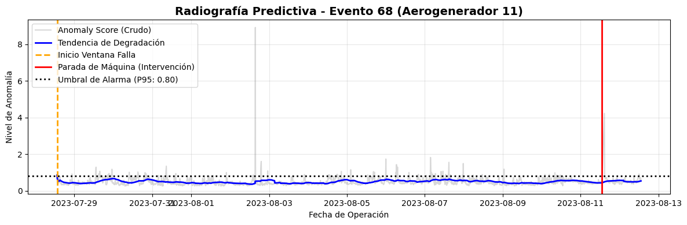
  
</p>
<p align="center">
  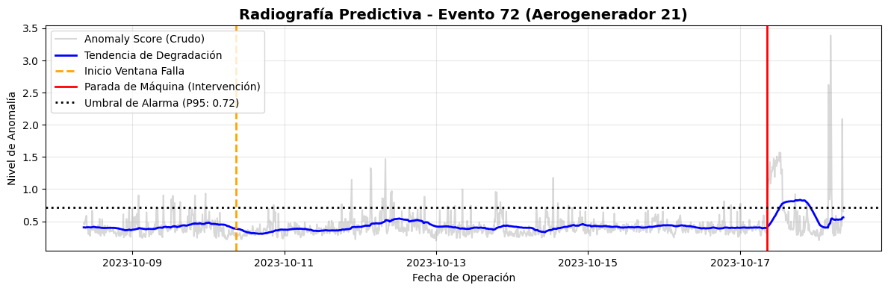
  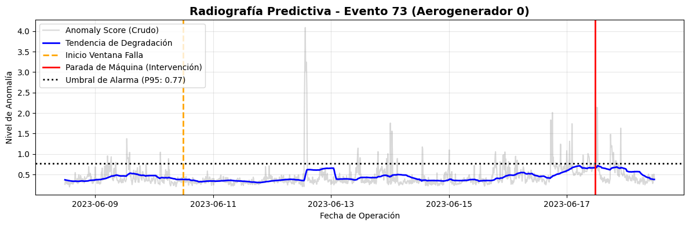
</p>
<p align="center">
  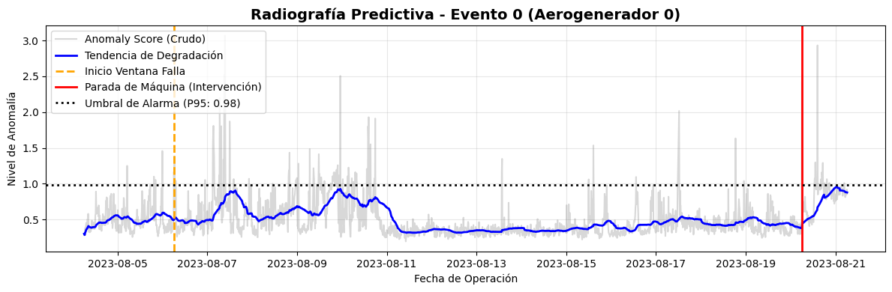
  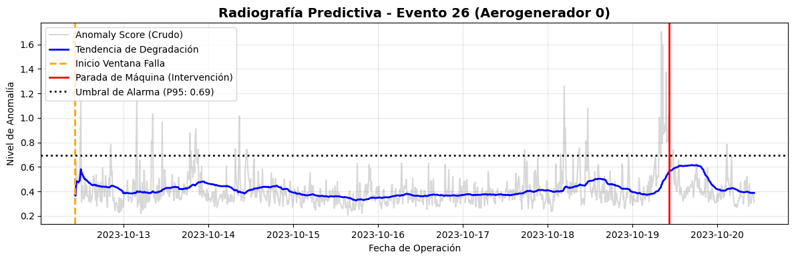
</p>
<p align="center">
  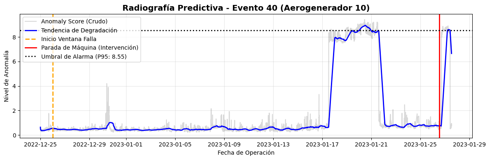
  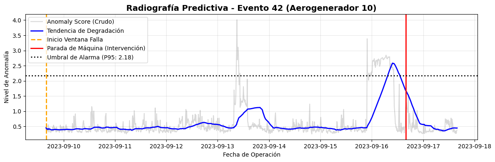
</p>
<p align="center">
  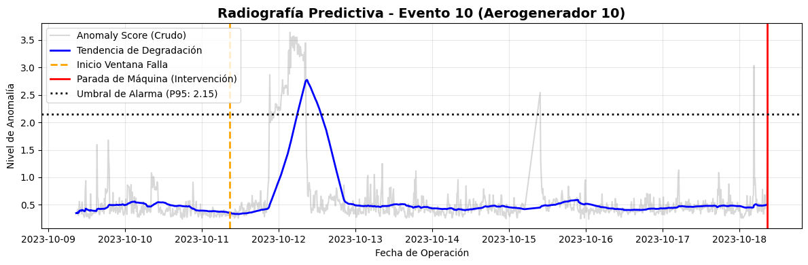
  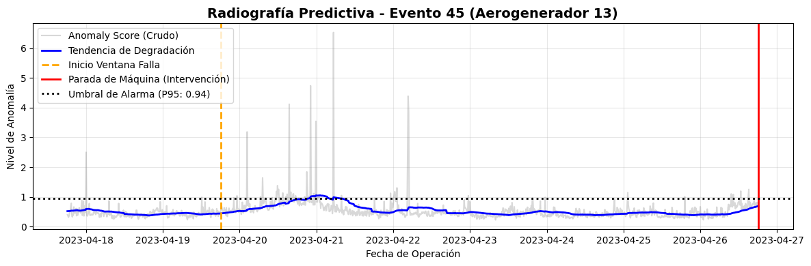
</p>
<p align="center">
  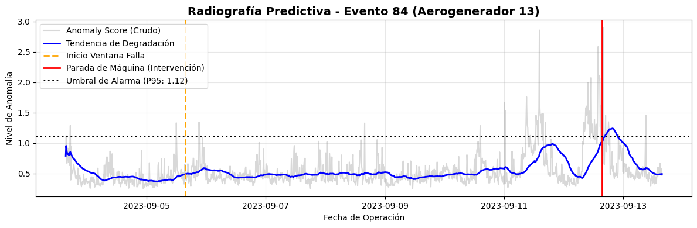
  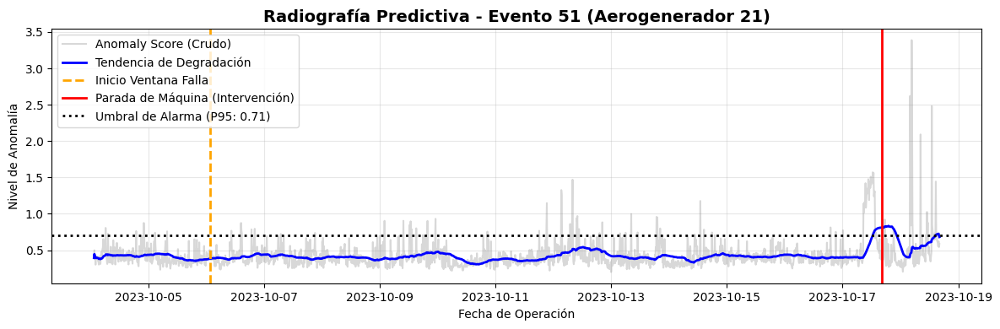
</p>

---

## Enfoque técnico

**Arquitectura:** Autoencoder denso con PReLU activations.
- Encoder: 200 → 100 → 50 → 20 (código latente)
- Decoder: simétrico
- Loss: MSE | Optimizer: Adam (lr=0.001)
- Un modelo por aerogenerador, entrenado solo con datos `status_type_id=0` (operación normal).

**Pipeline:**
1. Carga de eventos y unificación por aerogenerador.
2. Exclusión de "timestamps sagrados" (filas usadas en otros eventos de predicción) para evitar leakage.
3. Imputación + estandarización.
4. Entrenamiento del autoencoder sobre datos sanos.
5. Umbral de alarma: percentil 99 del error de reconstrucción en train.
6. Score de anomalía = RMSE de reconstrucción / umbral.

**Diagnóstico de sensores (ARCANA):**
Para cada evento detectado, el sistema reporta los sensores con mayor error de reconstrucción durante la ventana de falla y en el momento de la primera alarma — útil para que el técnico sepa dónde mirar.

**Sistema de protocolo escalonado:**
Clasificación del estado en niveles (Normal / Vigilancia / Crítico) según gradiente de score, persistencia y tipo de sensor afectado (térmico / hidráulico / eléctrico / red). Distingue fallas súbitas vs graduales.

---

## Stack

`Python` · `pandas` · `numpy` · `scikit-learn` · `TensorFlow / Keras` · `Matplotlib`

---

## Estructura

```
.
├── EARLY_FAULT_DETECTION.ipynb     # Notebook principal
├── results_early_fault_detection.csv
├── images/                          # Radiografías predictivas
└── README.md
```

---

## Cómo reproducir

1. Descargar el dataset CARE to Compare — Wind Farm A (Zenodo: https://zenodo.org/records/10958775).
2. Ajustar la variable `base` en la primera celda del notebook a la ruta local del dataset.
3. Ejecutar el notebook completo.

```bash
pip install pandas numpy scikit-learn tensorflow matplotlib
```

**Autor:** Enzo Rojas — [enzo.rojas.escobar@gmail.com](mailto:enzo.rojas.escobar@gmail.com)
